

  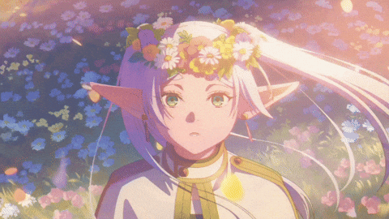

<h1 align="center">
  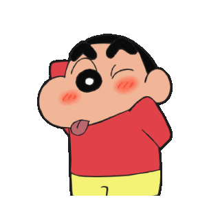
  សួស្តី, I'm Asuna 👋
</h1>

  <b>Front-end developer in training from Cambodia 🇰🇭</b> 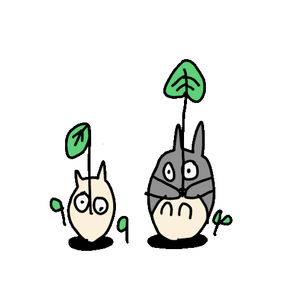 
  Building clean interfaces with Vue, Nuxt & React, and leveling up into full-stack.

  
  
  

  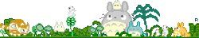

<table>
  <tr>
    <td width="62%" valign="top">
      <h2>👩‍💻 About Me 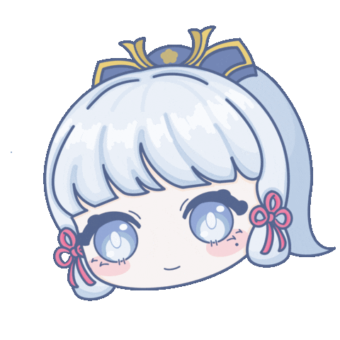</h2>
      
I'm <b>Sros Songha</b> (Asuna), a Computer Science freshman at the <b>Institute of Technology of Cambodia (ITC)</b> and a front-end intern.

      <ul>
        <li>🎨 <b>UI & Templates:</b> Where I craft clean, interactive, and responsive designs</li>
        <li>⚙️ <b>Logic & Backend:</b> Actively leveling up JavaScript logic, APIs, and databases</li>
        <li>🌏 <b>Local Impact:</b> Focused on Khmer-first interfaces for Cambodian users</li>
        <li>🧠 <b>Hands-on:</b> I learn best by building real-world projects and debugging them myself</li>
      </ul>
      <blockquote>still young, still learning.</blockquote>
    </td>
    <td width="38%" align="center" valign="middle">
      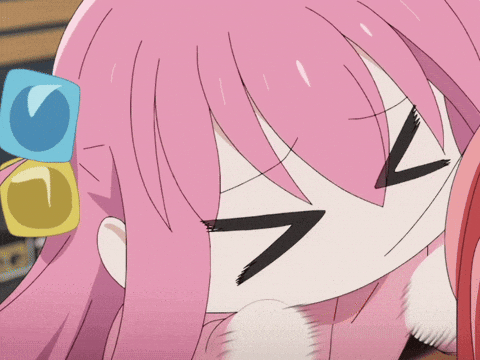
    </td>
  </tr>
</table>

<table>
  <tr>
    <td width="62%" valign="top">
      <h2>💼 Experience</h2>
      <table>
        <tr>
          <th>Role</th>
          <th>Company</th>
          <th>Period</th>
        </tr>
        <tr>
          <td>Front-end Intern</td>
          <td><b>T.O Group</b></td>
          <td>Aug 2026 – Present</td>
        </tr>
        <tr>
          <td>Front-end Intern</td>
          <td><b>EKYC Solution Co., Ltd.</b></td>
          <td>May 2026 – Aug 2026</td>
        </tr>
      </table>
      
At both internships I work on front-end features with <b>Vue, Nuxt, and Tailwind CSS</b>: turning designs into responsive UI, managing state, and connecting pages to APIs.

      <h2>🎓 Education</h2>
      
🏛️ <b>Institute of Technology of Cambodia (ITC)</b>: Computer Science (freshman)

    </td>
    <td width="38%" align="center" valign="middle">
      
        
      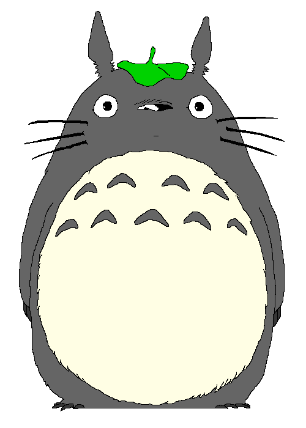
    </td>
  </tr>
</table>

<table>
  <tr>
    <td width="65%" valign="top">
      <h2>🛠️ Tech Stack</h2>
      
<b>Front-end</b>

      

        
        
        
        
        
        
        
        
        
        
        
      

      
<b>Back-end and Data (learning)</b> 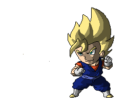

      

        
        
        
        
        
        
        
      

      
<b>Tools</b>

      

        
        
        
        
        
        
        
      

      
<b>Also exploring:</b> Python, Java, GSAP, Three.js

    </td>
    <td width="35%" align="center" valign="middle">
      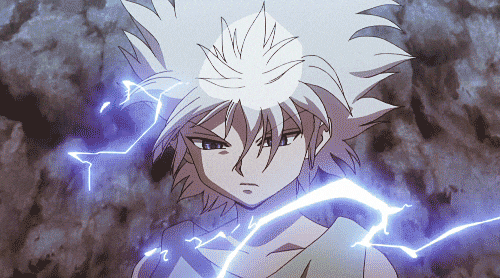
        
      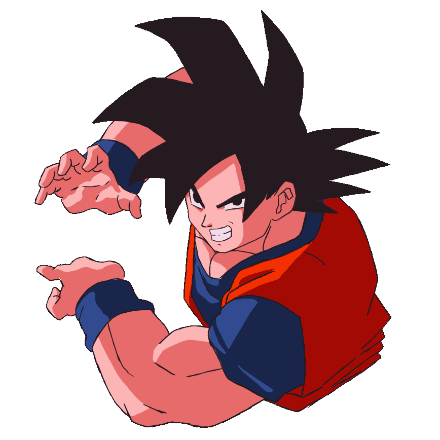
    </td>
  </tr>
</table>

  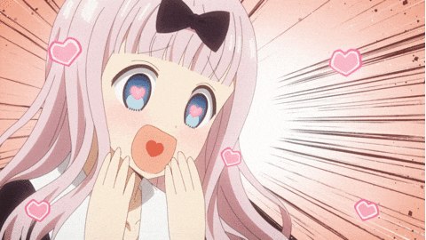

<h2 align="center">🚀 Featured Projects</h2>

<table>
  <tr>
    <td width="65%" valign="top">
      <h3>🏠 <a href="https://sroknh.com">Roomie (ស្រុកខ្ញុំ)</a></h3>
      
A room-rental platform for Cambodia, built with a team.

      <ul>
        <li>Nuxt + Vue front-end with <b>shadcn-vue</b> components and <b>Pinia</b> state</li>
        <li>English and Khmer language support</li>
        <li>Auth with <b>Clerk</b>, data on <b>Supabase</b>, deployed on <b>Cloudflare Pages</b></li>
        <li><b>My contribution:</b> UI, profile view/edit, listing location, and scientific calculator feature</li>
      </ul>
    </td>
    <td width="35%" align="center" valign="middle">
      
    </td>
  </tr>
</table>

<table>
  <tr>
    <td width="35%" align="center" valign="middle">
      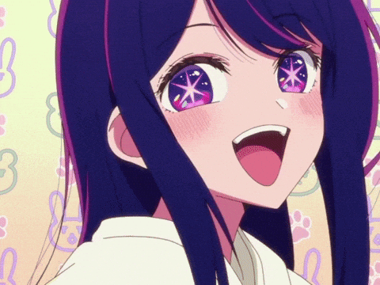
    </td>
    <td width="65%" valign="top">
      <h3>💸 <a href="https://github.com/srossongha/personal-finance-tracker">Personal Finance Tracker</a></h3>
      
A TypeScript app for tracking monthly spending, built to learn React and Next.js coming from Vue and Nuxt.

      <h3>🌐 <a href="https://portfolio.sanghakh122333.workers.dev/">Portfolio</a></h3>
      
My personal showcase site, built to demonstrate my design skills, responsive components, and interactive web projects.

    </td>
  </tr>
</table>

<table>
  <tr>
    <td width="65%" valign="top">
      <h3>🍳 <a href="https://github.com/srossongha/nuxt-recipe">nuxt-recipe</a> · 🧮 <a href="https://github.com/srossongha/Calculator">Calculator</a> · 🖼️ <a href="https://github.com/srossongha/landing-page">landing-page</a></h3>
      
Smaller Vue and Nuxt projects where I practice component architecture, state management, and responsive layouts.

    </td>
    <td width="35%" align="center" valign="middle">
      
    </td>
  </tr>
</table>

<table>
  <tr>
    <td width="60%" valign="top">
      <h2>🌱 Currently Learning</h2>
      <ul>
        <li>📦 State management in Vue/Nuxt & React</li>
        <li>🗄️ Database architecture & fundamentals</li>
        <li>🚀 NestJS with MySQL & PostgreSQL</li>
        <li>⚛️ Deep-dive into React and Next.js ecosystems</li>
        <li>🎨 Figma and modern UI/UX design systems</li>
      </ul>
      <blockquote>When unexpected bugs appear... keep pushing forward!</blockquote>
    </td>
    <td width="40%" align="center" valign="middle">
      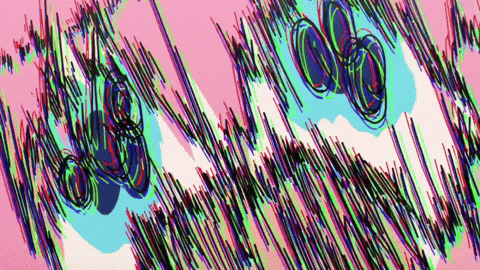
    </td>
  </tr>
</table>

  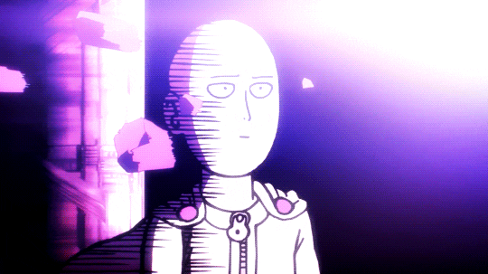 
  <em>One-punching bugs and production errors into oblivion</em> 💥

<table>
  <tr>
    <td width="60%" valign="top">
      <h2>🎮 Beyond Code</h2>
      <ul>
        <li>🎮 <b>Gamer since childhood</b> 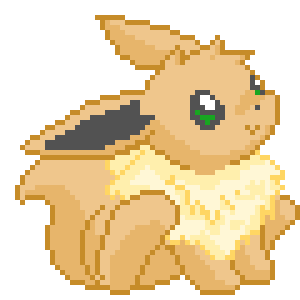</li>
        <li>⚔️ <b>Anime fan:</b> <i>Sword Art Online</i>, <i>Cyberpunk: Edgerunners</i>, <i>Death Note</i>, <i>Frieren</i>, and <i>Kaguya-sama</i></li>
        <li>🍰 <b>Coding Fuel:</b> Sweets, bubble tea, and hyper-focused night sessions</li>
      </ul>
    </td>
    <td width="40%" align="center" valign="middle">
      
    </td>
  </tr>
</table>

  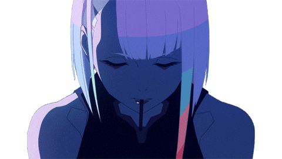

  

<table>
  <tr>
    <td width="60%" valign="top">
      <h2>📫 Let's Connect</h2>
      
I'm always open to learning opportunities, team collaboration, internship roles, and feedback on my projects. Let's connect and build something impactful together!

      <ul>
        <li>📧 <b>Email:</b> <a href="mailto:sanghakh122333@gmail.com">sanghakh122333@gmail.com</a></li>
        <li>💼 <b>LinkedIn:</b> <a href="https://linkedin.com/in/sros-songha-164656419">sros-songha-164656419</a></li>
        <li>🌐 <b>Portfolio:</b> <a href="https://portfolio.sanghakh122333.workers.dev/">portfolio.sanghakh122333.workers.dev</a></li>
      </ul>
    </td>
    <td width="40%" align="center" valign="middle">
      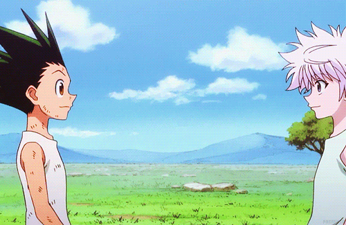
    </td>
  </tr>
</table>

  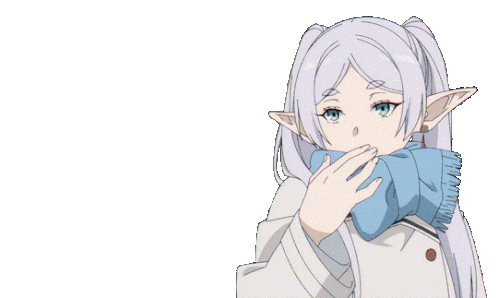
  &nbsp;&nbsp;&nbsp;&nbsp;&nbsp;&nbsp;
  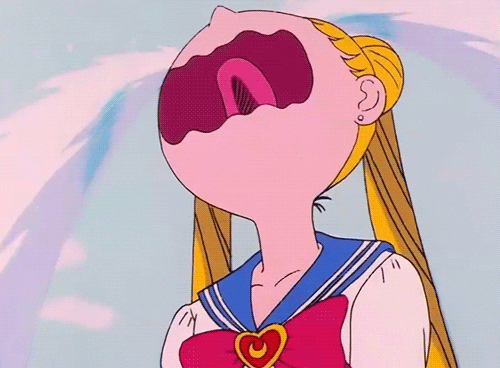
   
  <b>Leaving so soon? Thanks for stopping by ✨</b>

